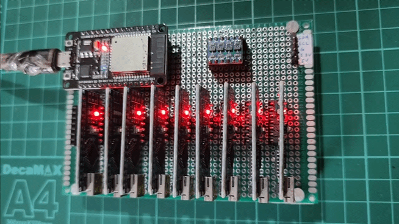

# DuinoCoinI2C_uPyMiner
This project design to mine Duino-Coin using an ESP32 MicroPython as a I2C master and AVR as worker

> [!IMPORTANT]
> This project is superceded by [DuinoI2C_ESP](https://github.com/JK-Rolling/DuinoI2C_ESP) due to MicroPython limited capability and speed.

# Testbench

```
[app][INFO]: POOL_INFO: Welcom to JK Rolling ESP32 I2C uPyMiner Testbench!
[app][INFO]: Periodic mining report:
[app][INFO]: 		‖ During the last 1 minute
[app][INFO]: 		‖ You've mined 269 shares (4.5 shares/s or 0.5 shares/s/active_worker)
[app][INFO]: 		‖ Where 269 shares accepted and 0 shares rejected
[app][INFO]: 		‖ With average hashrate of 343 H/s
[app][INFO]: 		‖ Total Blocks found: 0 
[app][INFO]: 		‖ Total miner uptime: 00d:00h:19m:07s
[app][INFO]: 		‖ Bus 0 worker(s): 9/9 online. (last contact: 30s)
[app][INFO]: 		‖ Soft limited to 9 active workers
[app][INFO]: RAM Total:146816 Free:90464 (61.62%)
```
